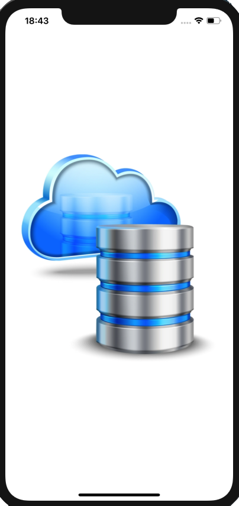
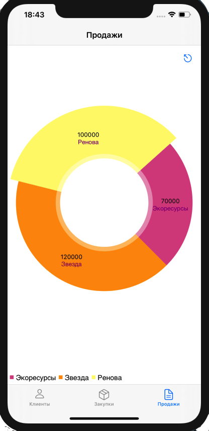

# Agent1C

The iOS application interacts with the 1C accounting system.

Агент 1С для iOS.

Приложение на iOS взаимодействует с учетной системой на 1С.

https://youtu.be/cC9dPtJV81I

Used:
- Swift
- DispatchQueue
- Autolayout
- MVC
- Storyboard/Xib
- JSON

UIKit:
- UITabBarController
- UIStoryboardSegue
- UITableViewController
- UITableViewCell
- UIRefreshControl
- UIAlertController

Foundation:
- Timer
